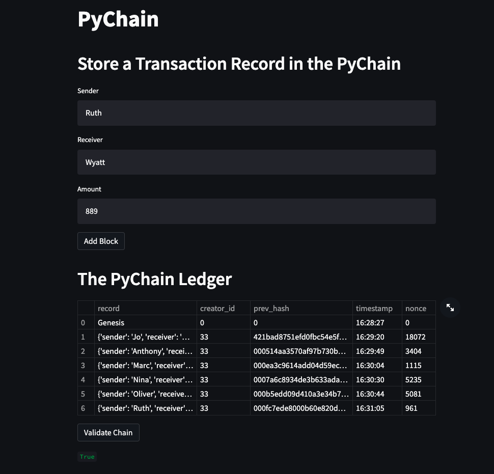
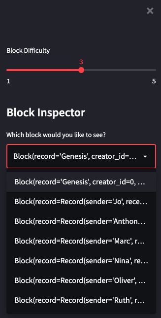

# Pychain_Ledger

This is a blockchain-based ledger system integrated with a user-friendly web interface. This ledger should allow partner banks to conduct financial transactions (that is, to transfer money between senders and receivers) and to verify the integrity of the data in the ledger.

Please be sure to install all the prerequisites (libraries) before running the program:

- `pip install streamlit`
- `pip install pandas`

Here is an example of the Pychain Ledger Web UI:

You can visualize the different blocks part of the chain.

This is an example of the block inspector:

